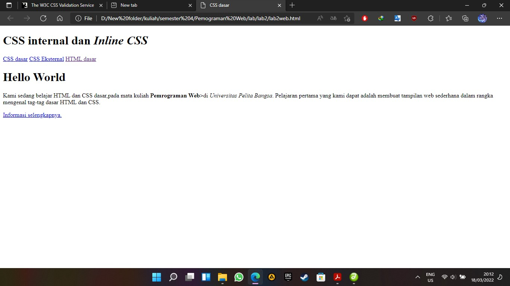
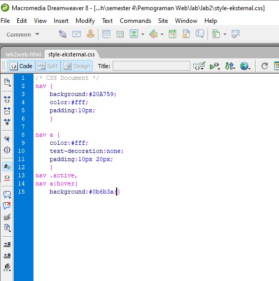
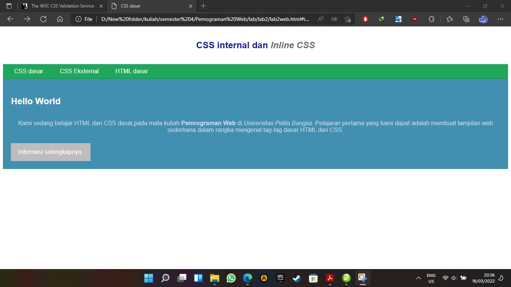

#lab2

# lab 2 Pemrogaman Web
# nama : Bagus tri handono - 312010170
# kelas : 20.TI.B1
-----------------------------------------------------------------------------------------------------
untuk source code lab 2 pemrograman WEB ada dibawah
 
[source code CSS dasar lengkap](lab2_css_dasar.html) 
[source code CSS dasar inline](lab2web.html) 
[source code CSS only](style-eksternal.css) 

pertama mari kita buat HTML sederhana  
 
dan setelah kita buat lalu save dan buka pada browser maka akan muncul seperti gambar dibawah 
 
setelah berhasil mari kita tambahkan sedikit perubahan menggunakan CSS inline 
 
setelah ditamabahkan coba save dan refresh browser maka akan menampilkan sedikit perubahan 
 
mari kita coba dengan merubah tampilan pada tag <u>
</u> 
 
setelah itu mari kita save dan coba refresh kembali browser 
 
 jika berhasil mari kita lanjut ke tahap selanjutnya yaitu membuat CSS eksternal 
 mari kita buat CSS eksternal dengan nama <b>style-eksternal.css</b> 
  
 jika sudah simpan dan panggil CSS tersebut di file HTML 
  
 jika sudah save file HTML tersebut dan refresh browser maka akan terjadi perubahan seperti dibawah ini 
  
 setelah berhasil mari kita tambahkan <b>ID Selector dan CLass selector</b> pada file CSS 
  
 setelah itu mari kita save file CSS dan lihat perubahannya pada browser 
  
 sekian terima kasih semoga bermanfaat
